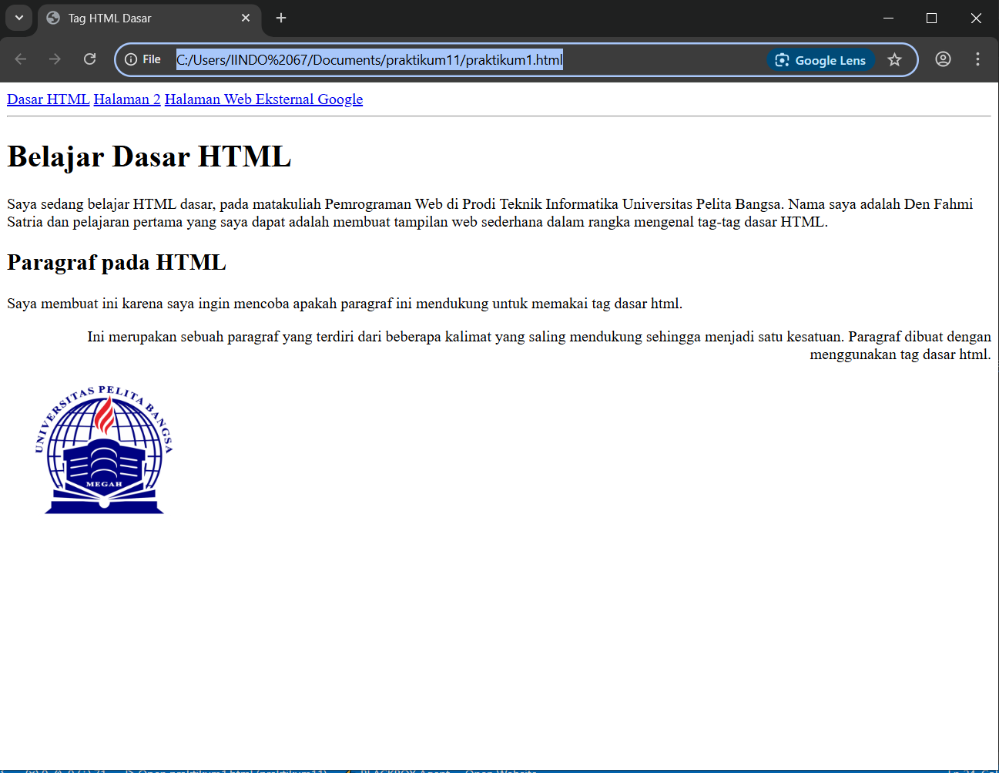

# Lab1Web
mempelajari dasar-dasar HTML <p>
Nama: Den fahmi Satria <p>
Nim: 312410523 <p>
Kelas: TI.24.A.5 <p>
## membuat file HTML, membuat title, dan menambahkan judul
 
- yang pertama adalah membuat file nya menjadi bentuk html dengan code <!doctype html> <p>
- kemudian membuat title dibagian head, dengan title: Belajar Dasar HTML <p>
- dan membuat paragraf dengan code (<p/p) <p>
- setelah itu di atas masing-masing paragraf saya tambahkan judul dengan code (h1) dan (h2) <p>
  hasilnya jika di jalankan akan seperti: <p>

## menambahkan atribut paragraf, menyisipkan gambar, dan menambahkan hyperlink
 
- saya menambahkan atribut paragraf pada setiap bagian bawah dari judul, pada judul 1 saya tambahkan atribut (align=center), dibawah judul 2 saya tambahkan atribut (align=left), dan dibawah paragraf yang sudah di ganti align=left saya tambahkan (align=right) (p)
- kemudian saya sisipkan gambar di bagian body dengan code 
- kemudian saya tambahkan hyperlink di bagian head tepat di bawah title dengan code
<nav) <p>
<a href="lab1_tag_dasar.html")Dasar HTML</a) <p>
<a href="lab1_halaman2.html")Halaman 2</a) <p>
<a href="http://www.google.com} Halaman Web Eksternal Google</a) <p>
</nav) <p>
<hr) <p>
dan inilah hasilnya

### Soal
Jawab Pertanyaan Berikut <p>
1. Lakukan perubahan pada kode sesuai dengan keinginan anda, amati perubahannya adakah <p>
error ketika terjadi kesalahan penulisan tag? <p>
2. Apa perbedaan dari tag (p) dengan tag <br>, berikan penjelasannya! <p>
3. Apa perbedaan atribut title dan alt pada tag , berikan penjelasannya! <p>
4. Untuk mengatur ukuran gambar, digunakan atribut width dan height. Agar tampilan gambar
proporsional sebaiknya kedua atribut tersebut diisi semua atau tidak? Berikan penjelasannya! <p>
5. Pada link tambahkan atribut target dengan nilai atribut bervariasi ( _blank, _self, _top,
_parent ), apa yang terjadi pada masing-masing nilai antribut tersebut? <p>

### JAWABAN
1. tidak terdapat error sama sekali untuk saya, karena saya sudah tau tata letak code yang seharusnya sehingga ketika saya coba sendiri, kode dengan lancar bisa di eksekusi oleh vscode, hanya saja 1 kekurangan saya yaitu vscode punya fitur pengetikan cerdas pada paragraf sehingga terkadang pembuka dan penutup paragraf saya terbalik <p>
2. p:  digunakan untuk membuat paragraf baru <p>
   br: break-line (untuk berpindah ke baris selanjutnya) <p>
3. alt: deskripsi tentang gambar (Teks alternatif jika gambar gagal dimuat) <p>
   title: judul gambar (Tooltip saat mouse diarahkan ke gambar dan memunculkan nya saat kursor mendekati gambar) <p>
4. Sebaiknya hanya salah satu yang diisi (biasanya width) agar proporsi gambar tetap terjaga. <p>
Jika keduanya diisi secara manual, pastikan rasio sesuai dengan ukuran asli gambar. Jika tidak, gambar bisa terlihat terdistorsi. <p>
5. - _blank: Membuka link di tab atau jendela baru <p>
   - _self: Membuka link di tab saat ini (default) <p>
   - _top: Membuka link di frame paling atas (menghapus semua frame) <p>
   - _parent: Membuka link di frame induk dari frame saat ini <p>
### code keseluruhan
``` <!doctype html>
<html>
<head>
    <title>Tag HTML Dasar</title>
<nav>
<a href="lab1_tag_dasar.html">Dasar HTML</a>
<a href="lab1_halaman2.html">Halaman 2</a>
<a href="http://www.google.com">Halaman Web Eksternal Google</a>
</nav>
<hr>
</head>
<body>
    <h1>Belajar Dasar HTML</h1>
    <p align=”center”>
Saya sedang belajar HTML dasar, pada matakuliah Pemrograman Web di Prodi
Teknik Informatika Universitas Pelita Bangsa. Nama saya adalah Den Fahmi Satria dan pelajaran pertama yang saya dapat
adalah membuat tampilan web sederhana dalam rangka mengenal tag-tag dasar
HTML.</p>
    <h2>Paragraf pada HTML</h2>
    <p align="left">
Saya membuat ini karena saya ingin mencoba apakah paragraf ini mendukung untuk memakai
tag dasar html.</p>
<p align="right">
Ini merupakan sebuah paragraf yang terdiri dari beberapa
kalimat yang saling mendukung sehingga menjadi satu kesatuan. Paragraf dibuat
dengan menggunakan tag dasar html.</p>

</body>
</html> '''
