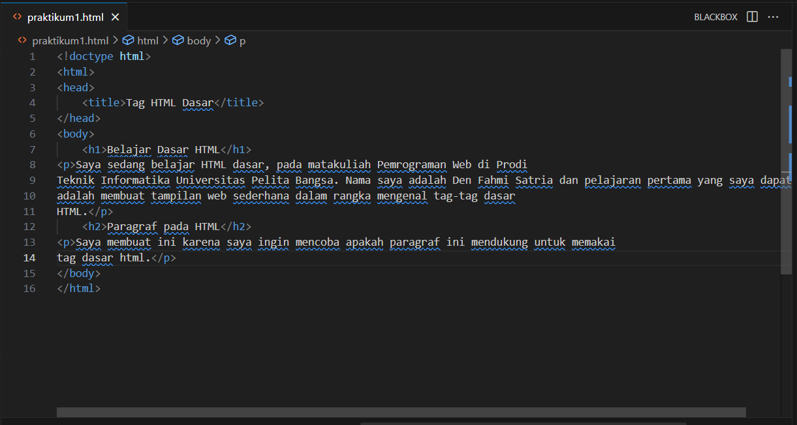
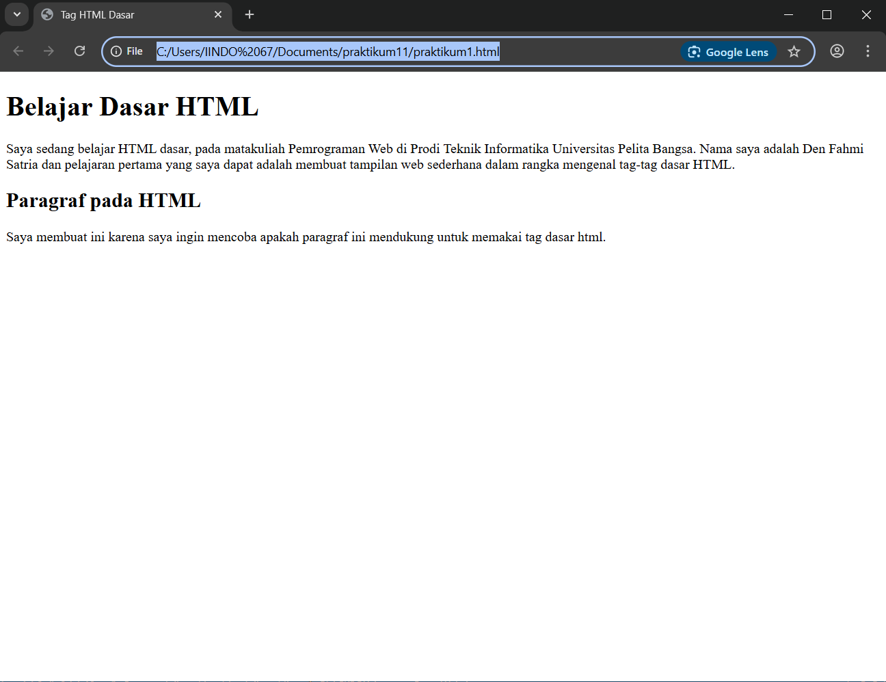
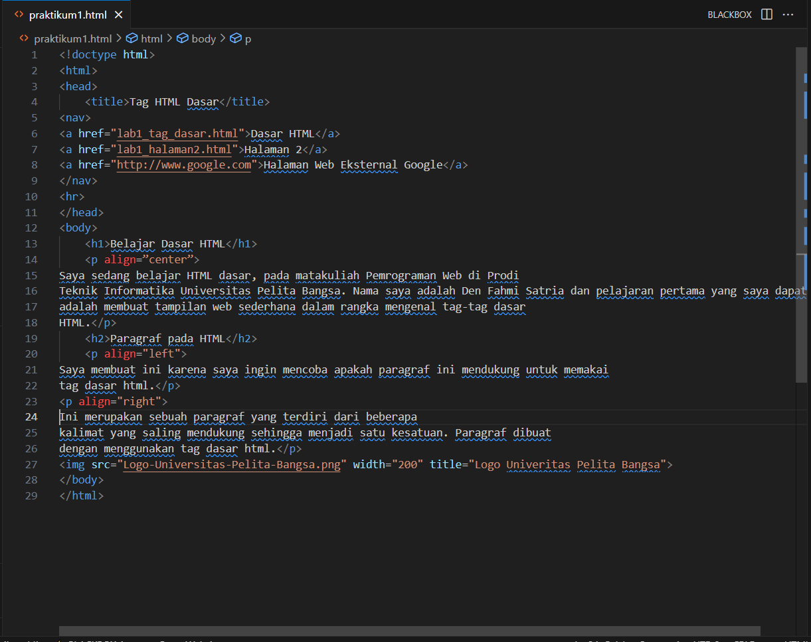

# Lab1Web
mempelajari dasar-dasar HTML 

Nama: Den fahmi Satria 

Nim: 312410523 

Kelas: TI.24.A.5 

## membuat file HTML, membuat title, dan menambahkan judul
 
- yang pertama adalah membuat file nya menjadi bentuk html dengan code <!doctype html> 

- kemudian membuat title dibagian head, dengan title: Belajar Dasar HTML 

- dan membuat paragraf dengan code (<p/p) 

- setelah itu di atas masing-masing paragraf saya tambahkan judul dengan code (h1) dan (h2) 

  hasilnya jika di jalankan akan seperti: 

## menambahkan atribut paragraf, menyisipkan gambar, dan menambahkan hyperlink
 
- saya menambahkan atribut paragraf pada setiap bagian bawah dari judul, pada judul 1 saya tambahkan atribut (align=center), dibawah judul 2 saya tambahkan atribut (align=left), dan dibawah paragraf yang sudah di ganti align=left saya tambahkan (align=right) (p)
- kemudian saya sisipkan gambar di bagian body dengan code 
- kemudian saya tambahkan hyperlink di bagian head tepat di bawah title dengan code
- <nav)
<a href="lab1_tag_dasar.html">Dasar HTML</a)
<a href="lab1_halaman2.html">Halaman 2</a)
<a href="http://www.google.com">Halaman Web Eksternal Google</a)
</nav)
<hr) 

